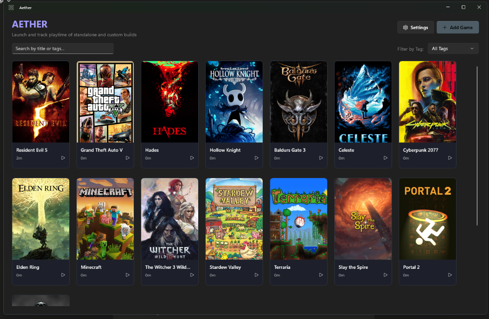

# Aether

Aether is a Windows desktop application built with WinUI 3 to launch and track the playtime of standalone and custom game builds. It provides a clean, grid-based library dashboard with tag-based filtering and automatic cover art retrieval.



## Features

- Game Library: Grid dashboard displaying game covers, titles, and total playtime.
- Playtime Tracking: Tracks active execution duration and updates playtime automatically.
- Automatic Cover Art: Integrates with SteamGridDB to search and fetch game cover thumbnails.
- Title Cleaning: Auto-populates game titles from folder segments, stripping common suffix tags (e.g. Definitive Edition, Gold Edition) and replacing underscores/hyphens.
- Path Management: Automatic scanning for folder executables with confirmation gating for multiple candidates.
- Search and Filters: Search games by title and filter by custom tags.

## Installation

You can download the latest installer from the GitHub Releases page.

1. Download AetherSetup.exe from the latest release.
2. Run the installer (runs as a user-level program, requiring no administrator privileges).
3. Complete the installation and launch Aether.

## Getting Started

### SteamGridDB Cover Art Setup
To fetch cover art automatically from SteamGridDB:
1. Go to steamgriddb.com and log in with your Steam account.
2. Navigate to your Profile Preferences -> API tab.
3. Click "Generate API Key" and copy the key.
4. In Aether, click "Settings" in the top-right corner.
5. Paste your API key and click "Save".

## Development

### Prerequisites
- .NET 8.0 SDK
- Inno Setup 6 (to compile setup installers locally)

### Build and Package
To publish the application locally:
```powershell
dotnet publish GameShelf.csproj -c Release -r win-x64 --self-contained true -p:WindowsPackageType=None
```

To compile the setup installer:
```powershell
& "C:\Users\<YourUsername>\AppData\Local\Programs\Inno Setup 6\ISCC.exe" installer.iss
```
